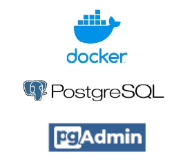
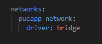
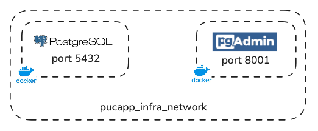
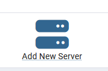
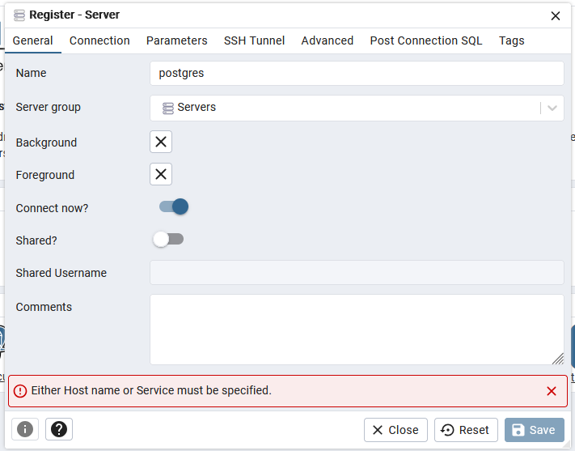
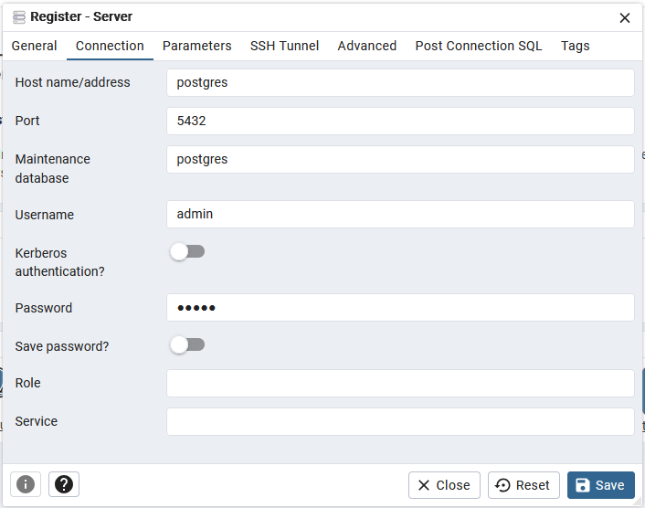

# PUCAPP SERVICE INFRA
Gilmar Neves

## Summary

- [Introduction](#introduction)
- [Tech and Tools](#tech-and-tools)
- [Architecture](#architecture)
- [Use](#use)

### Introduction

PucappService is a MVP for evaluating the capabilities of Microservices in an app that serves the purpose of being a shopping service coupled with an users registering service.

This repository creates the infrastructure required to run the PucappService upon it. It comprises of databases and a network for all the services to use, communicate to one another, and communicate to external users.

### Tech and Tools
  


As it is to run primarily in a local development environment, we use Docker for building the services infrastructure.

The network are created on the Docker compose  for a local scope and using the bridge as driver.



The databases (users_db and shopping_db) are created on a PostgreSQL instance that runs in this network.
There is also a PGAdmin service for accessing and managing the database.

### Architecture

The containers we have run on the same docker network and, thus, can communicate to each other in a easily manner.

PostgreSQL is exposed on port 5432.
PGAdmin is exposed on port 8001.



It is important to mention that all the other services, APIs, are to run in the same network for better and ease of communication.

### Use

In order to use this for running the project, please follow the steps described below:

i) Clone the repository into your machine as:

```
git clone https://github.com/nevesgil/pucapp_infra.git
```

ii) Run the docker compose file

Having the Docker up and running on your machine, you may simply run the command below to have the services running:

```
docker compose up -d --build
```

Obs:
When not using the service anymore, run:
```
docker compose down
```

#### **For any other container to have access to this infrastructure, you need to make sure they have access to the network created.**

iii) **(Optional)**  If necessary, access the pgAdmin service on https://localhost:8001.

The credentials are:

   ```
   user = admin@pgadmin.com
   password = admin
   ``` 

Add new server:



Register server as postgres:



Register host name, port and credentials using 'admin'as password:


